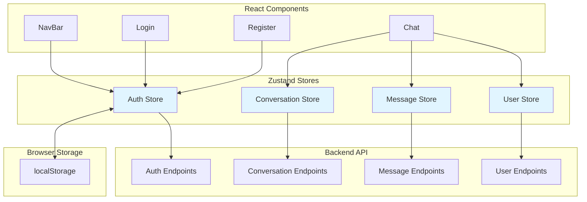

# Tài Liệu Thiết Kế: Tích Hợp Zustand State Management

## Tổng Quan

Tài liệu này mô tả thiết kế chi tiết cho việc tích hợp thư viện quản lý state Zustand vào ứng dụng chat React hiện có. Thiết kế này tập trung vào việc tạo ra bốn stores chính (Auth, Conversation, Message, User) để quản lý state ứng dụng một cách tập trung, có thể mở rộng và dễ bảo trì.

### Mục Tiêu Thiết Kế

1. **Tập trung hóa quản lý state**: Di chuyển từ state cục bộ trong component sang global state management
2. **Persistence**: Lưu trữ state quan trọng (authentication) vào localStorage
3. **Type safety**: Cung cấp TypeScript interfaces và JSDoc comments cho developer experience tốt hơn
4. **API integration**: Tích hợp các API calls trực tiếp vào store actions
5. **Error handling**: Xử lý lỗi và loading states một cách nhất quán

### Công Nghệ Sử Dụng

- **Zustand 5.x**: Thư viện quản lý state chính
- **zustand/middleware/persist**: Middleware để persist state vào localStorage
- **React 19.x**: Framework UI
- **Axios/Fetch API**: HTTP client cho API calls

## Kiến Trúc

### Tổng Quan Kiến Trúc



### Cấu Trúc Thư Mục

```
chat-frontend/src/
├── stores/
│   ├── authStore.js          # Auth state management
│   ├── conversationStore.js  # Conversation state management
│   ├── messageStore.js       # Message state management
│   ├── userStore.js          # User state management
│   └── index.js              # Export tất cả stores
├── types/
│   └── store.types.js        # TypeScript type definitions (JSDoc)
├── utils/
│   └── api.js                # API client configuration
└── components/
    └── ... (existing components)
```

### Luồng Dữ Liệu

1. **Component → Store**: Component gọi store actions thông qua hooks
2. **Store → API**: Store actions thực hiện HTTP requests đến backend
3. **API → Store**: Response data được lưu vào store state
4. **Store → Component**: Component tự động re-render khi store state thay đổi
5. **Store ↔ localStorage**: Auth store tự động sync với localStorage

## Components và Interfaces

### 1. Auth Store

#### State Shape

```javascript
{
  // User data
  user: {
    id: string | null,
    name: string | null,
    email: string | null,
    avatar: string | null
  },
  
  // Authentication tokens
  accessToken: string | null,
  refreshToken: string | null,
  
  // UI states
  isAuthenticated: boolean,
  isLoading: boolean,
  error: string | null,
  
  // Hydration state
  isHydrated: boolean
}
```

#### Actions

```javascript
{
  // Authentication actions
  login: (email: string, password: string) => Promise<void>,
  register: (name: string, email: string, password: string) => Promise<void>,
  logout: () => void,
  refreshAccessToken: () => Promise<void>,
  
  // State management
  setUser: (user: User) => void,
  setTokens: (accessToken: string, refreshToken: string) => void,
  clearAuth: () => void,
  setError: (error: string | null) => void,
  setLoading: (isLoading: boolean) => void,
  
  // Utility
  checkAuth: () => boolean,
  validateToken: () => Promise<boolean>
}
```

#### API Integration

- **POST /auth/login**: Đăng nhập người dùng
- **POST /auth/register**: Đăng ký người dùng mới
- **POST /auth/refresh**: Làm mới access token
- **POST /auth/logout**: Đăng xuất người dùng
- **GET /auth/me**: Lấy thông tin người dùng hiện tại

### 2. Conversation Store

#### State Shape

```javascript
{
  // Conversation data
  conversations: Array<{
    id: string,
    participants: Array<string>,
    lastMessage: {
      content: string,
      timestamp: string,
      senderId: string
    } | null,
    unreadCount: number,
    createdAt: string,
    updatedAt: string
  }>,
  
  // Active conversation
  activeConversationId: string | null,
  
  // UI states
  isLoading: boolean,
  error: string | null
}
```

#### Actions

```javascript
{
  // Conversation CRUD
  fetchConversations: () => Promise<void>,
  createConversation: (participantIds: Array<string>) => Promise<void>,
  deleteConversation: (conversationId: string) => Promise<void>,
  
  // Active conversation management
  setActiveConversation: (conversationId: string) => void,
  clearActiveConversation: () => void,
  
  // Conversation updates
  updateLastMessage: (conversationId: string, message: Message) => void,
  incrementUnreadCount: (conversationId: string) => void,
  resetUnreadCount: (conversationId: string) => void,
  
  // State management
  setError: (error: string | null) => void,
  setLoading: (isLoading: boolean) => void,
  reset: () => void
}
```

#### API Integration

- **GET /conversations**: Lấy danh sách conversations
- **POST /conversations**: Tạo conversation mới
- **DELETE /conversations/:id**: Xóa conversation
- **PATCH /conversations/:id**: Cập nhật conversation metadata

### 3. Message Store

#### State Shape

```javascript
{
  // Messages grouped by conversation
  messagesByConversation: {
    [conversationId: string]: Array<{
      id: string,
      conversationId: string,
      senderId: string,
      content: string,
      timestamp: string,
      isRead: boolean,
      status: 'sending' | 'sent' | 'failed'
    }>
  },
  
  // Loading states per conversation
  loadingStates: {
    [conversationId: string]: boolean
  },
  
  // Error states per conversation
  errorStates: {
    [conversationId: string]: string | null
  }
}
```

#### Actions

```javascript
{
  // Message CRUD
  fetchMessages: (conversationId: string) => Promise<void>,
  sendMessage: (conversationId: string, content: string) => Promise<void>,
  deleteMessage: (messageId: string) => Promise<void>,
  
  // Message status
  markAsRead: (conversationId: string, messageIds: Array<string>) => Promise<void>,
  updateMessageStatus: (messageId: string, status: string) => void,
  
  // Real-time updates
  addMessage: (message: Message) => void,
  
  // State management
  clearMessages: (conversationId: string) => void,
  setError: (conversationId: string, error: string | null) => void,
  setLoading: (conversationId: string, isLoading: boolean) => void,
  reset: () => void
}
```

#### API Integration

- **GET /messages/:conversationId**: Lấy messages của conversation
- **POST /messages**: Gửi message mới
- **DELETE /messages/:id**: Xóa message
- **PATCH /messages/read**: Đánh dấu messages là đã đọc

### 4. User Store

#### State Shape

```javascript
{
  // All users in system
  users: Array<{
    id: string,
    name: string,
    email: string,
    avatar: string | null,
    isOnline: boolean,
    lastSeen: string | null
  }>,
  
  // Current user profile (duplicate from Auth for convenience)
  currentUser: User | null,
  
  // Cache metadata
  lastFetchTime: number | null,
  
  // UI states
  isLoading: boolean,
  error: string | null
}
```

#### Actions

```javascript
{
  // User data fetching
  fetchUsers: (forceRefresh?: boolean) => Promise<void>,
  fetchUserById: (userId: string) => Promise<void>,
  
  // User search
  searchUsers: (query: string) => Array<User>,
  filterUsers: (predicate: (user: User) => boolean) => Array<User>,
  
  // Current user
  setCurrentUser: (user: User) => void,
  updateCurrentUser: (updates: Partial<User>) => Promise<void>,
  
  // Online status
  updateUserOnlineStatus: (userId: string, isOnline: boolean) => void,
  
  // State management
  setError: (error: string | null) => void,
  setLoading: (isLoading: boolean) => void,
  reset: () => void
}
```

#### API Integration

- **GET /users**: Lấy danh sách tất cả users
- **GET /users/:id**: Lấy thông tin user cụ thể
- **PATCH /users/:id**: Cập nhật thông tin user
- **GET /users/search?q=**: Tìm kiếm users

## Data Models

### User Model

```javascript
/**
 * @typedef {Object} User
 * @property {string} id - Unique user identifier
 * @property {string} name - User's display name
 * @property {string} email - User's email address
 * @property {string|null} avatar - URL to user's avatar image
 * @property {boolean} isOnline - Online status
 * @property {string|null} lastSeen - ISO timestamp of last activity
 */
```

### Conversation Model

```javascript
/**
 * @typedef {Object} Conversation
 * @property {string} id - Unique conversation identifier
 * @property {Array<string>} participants - Array of user IDs
 * @property {Message|null} lastMessage - Most recent message
 * @property {number} unreadCount - Number of unread messages
 * @property {string} createdAt - ISO timestamp of creation
 * @property {string} updatedAt - ISO timestamp of last update
 */
```

### Message Model

```javascript
/**
 * @typedef {Object} Message
 * @property {string} id - Unique message identifier
 * @property {string} conversationId - Parent conversation ID
 * @property {string} senderId - User ID of sender
 * @property {string} content - Message text content
 * @property {string} timestamp - ISO timestamp of message
 * @property {boolean} isRead - Read status
 * @property {'sending'|'sent'|'failed'} status - Delivery status
 */
```

### Auth State Model

```javascript
/**
 * @typedef {Object} AuthState
 * @property {User|null} user - Authenticated user data
 * @property {string|null} accessToken - JWT access token
 * @property {string|null} refreshToken - JWT refresh token
 * @property {boolean} isAuthenticated - Authentication status
 * @property {boolean} isLoading - Loading state
 * @property {string|null} error - Error message
 * @property {boolean} isHydrated - Hydration completion status
 */
```

## Correctness Properties

*Một property (tính chất) là một đặc điểm hoặc hành vi phải đúng trong tất cả các lần thực thi hợp lệ của hệ thống - về cơ bản, đó là một phát biểu chính thức về những gì hệ thống nên làm. Properties đóng vai trò là cầu nối giữa các đặc tả có thể đọc được bởi con người và các đảm bảo tính đúng đắn có thể xác minh được bằng máy.*


### Property 1: Đăng nhập thành công lưu trữ credentials

*Với bất kỳ* thông tin đăng nhập hợp lệ (email, password), sau khi gọi login() thành công, Auth_Store phải chứa accessToken, refreshToken và user data tương ứng

**Validates: Requirements 2.2**

### Property 2: Đăng xuất xóa toàn bộ auth state

*Với bất kỳ* auth state nào (có hoặc không có user đã đăng nhập), sau khi gọi logout(), Auth_Store phải có user = null, accessToken = null, refreshToken = null, và isAuthenticated = false

**Validates: Requirements 2.3, 9.3**

### Property 3: Auth state persistence round-trip

*Với bất kỳ* auth state hợp lệ nào, sau khi lưu vào localStorage và khởi tạo lại store, state được khôi phục phải giống với state ban đầu

**Validates: Requirements 2.5, 2.6**

### Property 4: Authentication status consistency

*Với bất kỳ* auth state nào, isAuthenticated phải là true khi và chỉ khi accessToken không null và chưa hết hạn

**Validates: Requirements 2.7**

### Property 5: Tạo conversation thêm vào danh sách

*Với bất kỳ* danh sách conversations hiện có và participant IDs hợp lệ, sau khi createConversation() thành công, danh sách conversations phải dài hơn và chứa conversation mới với đúng participants

**Validates: Requirements 3.3**

### Property 6: Chọn conversation cập nhật active state

*Với bất kỳ* conversation ID hợp lệ trong danh sách, sau khi gọi setActiveConversation(id), activeConversationId phải bằng id đó

**Validates: Requirements 3.4**

### Property 7: Message mới cập nhật conversation preview

*Với bất kỳ* conversation và message mới, sau khi message được thêm vào, lastMessage của conversation tương ứng phải match với message đó (content, timestamp, senderId)

**Validates: Requirements 3.7**

### Property 8: Thêm message vào conversation

*Với bất kỳ* conversation ID và message content, sau khi sendMessage() hoặc addMessage() thành công, message list của conversation đó phải chứa message mới với đúng content và metadata

**Validates: Requirements 4.3, 4.4**

### Property 9: Đánh dấu messages là đã đọc

*Với bất kỳ* tập hợp message IDs, sau khi gọi markAsRead(), tất cả messages có ID trong tập hợp đó phải có isRead = true

**Validates: Requirements 4.5**

### Property 10: Xóa messages của conversation

*Với bất kỳ* conversation ID, sau khi gọi clearMessages(conversationId), messagesByConversation[conversationId] phải là mảng rỗng hoặc undefined

**Validates: Requirements 4.7**

### Property 11: Cập nhật user profile phản ánh ngay lập tức

*Với bất kỳ* user updates (partial user object), sau khi gọi updateCurrentUser(updates), currentUser phải chứa tất cả các thay đổi từ updates

**Validates: Requirements 5.4**

### Property 12: Search users trả về kết quả chính xác

*Với bất kỳ* search query string, kết quả từ searchUsers(query) phải chỉ chứa users có name hoặc email chứa query (case-insensitive)

**Validates: Requirements 5.5**

### Property 13: User cache giảm API calls

*Với bất kỳ* trạng thái User_Store, nếu gọi fetchUsers() hai lần liên tiếp trong khoảng thời gian ngắn (< 5 phút) mà không có forceRefresh=true, lần gọi thứ hai không nên trigger API request mới

**Validates: Requirements 5.6**

### Property 14: Failed operations set error state

*Với bất kỳ* store action gây ra API failure, error state của store tương ứng phải được set với error message mô tả (không null, không empty)

**Validates: Requirements 7.5, 8.5**

### Property 15: Loading state lifecycle

*Với bất kỳ* async store operation, isLoading phải là true trong khi operation đang pending, và phải là false sau khi operation hoàn thành (success hoặc failure)

**Validates: Requirements 7.6, 8.6, 8.7**

### Property 16: Authenticated requests include token

*Với bất kỳ* API request từ Conversation_Store, Message_Store, hoặc User_Store khi user đã authenticated, request headers phải chứa Authorization header với format "Bearer {accessToken}"

**Validates: Requirements 7.7**

### Property 17: Token validation on app startup

*Với bất kỳ* accessToken được hydrate từ localStorage khi app khởi động, Auth_Store phải gọi API để validate token trước khi set isAuthenticated = true

**Validates: Requirements 9.2**

### Property 18: Store reset trở về initial state

*Với bất kỳ* store state (Auth, Conversation, Message, User), sau khi gọi reset(), state phải giống với initial state (tất cả arrays rỗng, tất cả objects null, flags về false)

**Validates: Requirements 9.4**

### Property 19: User switching clears previous data

*Với bất kỳ* user đang đăng nhập, khi login với user khác, tất cả stores phải không chứa dữ liệu của user trước đó (conversations, messages, cached users)

**Validates: Requirements 9.5**

## Xử Lý Lỗi

### Chiến Lược Xử Lý Lỗi

Tất cả stores sẽ implement error handling nhất quán:

1. **API Errors**: Catch và transform thành user-friendly messages
2. **Network Errors**: Phát hiện và thông báo connection issues
3. **Validation Errors**: Validate input trước khi gọi API
4. **Token Expiration**: Tự động refresh token hoặc redirect đến login

### Error State Structure

```javascript
{
  error: {
    message: string,      // User-friendly error message
    code: string | null,  // Error code từ backend
    field: string | null  // Field gây lỗi (cho validation errors)
  } | null
}
```

### Error Handling Patterns

#### 1. Auth Store Errors

```javascript
// Login error
try {
  const response = await api.post('/auth/login', { email, password });
  // ... handle success
} catch (error) {
  if (error.response?.status === 401) {
    set({ error: 'Email hoặc mật khẩu không đúng' });
  } else if (error.response?.status === 429) {
    set({ error: 'Quá nhiều lần thử. Vui lòng thử lại sau' });
  } else {
    set({ error: 'Đã xảy ra lỗi. Vui lòng thử lại' });
  }
}
```

#### 2. Token Refresh Error

```javascript
// Khi refresh token fails, logout user
try {
  const response = await api.post('/auth/refresh', { refreshToken });
  // ... handle success
} catch (error) {
  // Token không hợp lệ, force logout
  get().logout();
  set({ error: 'Phiên đăng nhập đã hết hạn. Vui lòng đăng nhập lại' });
}
```

#### 3. Network Errors

```javascript
// Detect network issues
try {
  const response = await api.get('/conversations');
  // ... handle success
} catch (error) {
  if (!error.response) {
    // Network error
    set({ error: 'Không thể kết nối đến server. Kiểm tra kết nối mạng' });
  } else {
    set({ error: 'Đã xảy ra lỗi khi tải dữ liệu' });
  }
}
```

#### 4. Validation Errors

```javascript
// Validate before API call
sendMessage: async (conversationId, content) => {
  if (!content || content.trim().length === 0) {
    set({ 
      errorStates: { 
        ...get().errorStates, 
        [conversationId]: 'Tin nhắn không được để trống' 
      } 
    });
    return;
  }
  
  // ... proceed with API call
}
```

### Error Recovery

1. **Retry Logic**: Implement exponential backoff cho transient errors
2. **Offline Support**: Queue actions khi offline, sync khi online
3. **Optimistic Updates**: Update UI trước, rollback nếu API fails
4. **Error Boundaries**: Component-level error boundaries để catch rendering errors

## Chiến Lược Testing

### Dual Testing Approach

Chúng ta sẽ sử dụng cả **unit tests** và **property-based tests** để đảm bảo tính đúng đắn toàn diện:

- **Unit tests**: Kiểm tra các ví dụ cụ thể, edge cases, và error conditions
- **Property tests**: Xác minh các properties phổ quát trên nhiều inputs ngẫu nhiên

### Property-Based Testing

**Thư viện**: Sử dụng **fast-check** cho JavaScript/TypeScript property-based testing

**Cấu hình**: Mỗi property test chạy tối thiểu **100 iterations** với random inputs

**Tagging**: Mỗi property test phải có comment tag:
```javascript
// Feature: zustand-state-management, Property 1: Đăng nhập thành công lưu trữ credentials
```

### Test Structure

```
chat-frontend/src/
├── stores/
│   ├── __tests__/
│   │   ├── authStore.test.js           # Unit tests
│   │   ├── authStore.property.test.js  # Property tests
│   │   ├── conversationStore.test.js
│   │   ├── conversationStore.property.test.js
│   │   ├── messageStore.test.js
│   │   ├── messageStore.property.test.js
│   │   ├── userStore.test.js
│   │   └── userStore.property.test.js
│   └── ...
```

### Unit Testing Strategy

#### Auth Store Unit Tests

1. **Login success**: Test với valid credentials
2. **Login failure**: Test với invalid credentials
3. **Logout**: Test cleanup của auth state
4. **Token refresh**: Test refresh flow
5. **Hydration**: Test loading từ localStorage
6. **Edge cases**:
   - Empty email/password
   - Malformed tokens
   - Expired tokens

#### Conversation Store Unit Tests

1. **Fetch conversations**: Test loading conversation list
2. **Create conversation**: Test tạo conversation mới
3. **Select conversation**: Test active conversation state
4. **Update last message**: Test metadata update
5. **Edge cases**:
   - Empty conversation list
   - Invalid conversation ID
   - Duplicate conversations

#### Message Store Unit Tests

1. **Fetch messages**: Test loading message history
2. **Send message**: Test gửi message mới
3. **Receive message**: Test nhận message real-time
4. **Mark as read**: Test update read status
5. **Clear messages**: Test cleanup khi switch conversation
6. **Edge cases**:
   - Empty message content
   - Very long messages
   - Messages với special characters

#### User Store Unit Tests

1. **Fetch users**: Test loading user list
2. **Search users**: Test search functionality
3. **Update profile**: Test cập nhật current user
4. **Cache behavior**: Test không gọi API khi có cache
5. **Edge cases**:
   - Empty user list
   - Search với no results
   - Invalid user ID

### Property-Based Testing Strategy

#### Example Property Test (Auth Store)

```javascript
import fc from 'fast-check';
import { renderHook, act } from '@testing-library/react';
import { useAuthStore } from '../authStore';

// Feature: zustand-state-management, Property 2: Đăng xuất xóa toàn bộ auth state
describe('Auth Store Properties', () => {
  it('logout clears all auth state', () => {
    fc.assert(
      fc.property(
        fc.record({
          user: fc.record({
            id: fc.string(),
            name: fc.string(),
            email: fc.emailAddress()
          }),
          accessToken: fc.string(),
          refreshToken: fc.string()
        }),
        (authState) => {
          const { result } = renderHook(() => useAuthStore());
          
          // Setup: Set auth state
          act(() => {
            result.current.setUser(authState.user);
            result.current.setTokens(authState.accessToken, authState.refreshToken);
          });
          
          // Action: Logout
          act(() => {
            result.current.logout();
          });
          
          // Assert: All auth data cleared
          expect(result.current.user).toBeNull();
          expect(result.current.accessToken).toBeNull();
          expect(result.current.refreshToken).toBeNull();
          expect(result.current.isAuthenticated).toBe(false);
        }
      ),
      { numRuns: 100 }
    );
  });
});
```

#### Property Test Generators

Sử dụng fast-check arbitraries để generate test data:

```javascript
// User generator
const userArbitrary = fc.record({
  id: fc.uuid(),
  name: fc.string({ minLength: 1, maxLength: 50 }),
  email: fc.emailAddress(),
  avatar: fc.option(fc.webUrl(), { nil: null })
});

// Message generator
const messageArbitrary = fc.record({
  id: fc.uuid(),
  conversationId: fc.uuid(),
  senderId: fc.uuid(),
  content: fc.string({ minLength: 1, maxLength: 1000 }),
  timestamp: fc.date().map(d => d.toISOString()),
  isRead: fc.boolean()
});

// Conversation generator
const conversationArbitrary = fc.record({
  id: fc.uuid(),
  participants: fc.array(fc.uuid(), { minLength: 2, maxLength: 10 }),
  unreadCount: fc.nat(100)
});
```

### Integration Testing

Test tương tác giữa stores:

1. **Login → Fetch Data**: Sau khi login, fetch conversations và users
2. **Send Message → Update Conversation**: Gửi message cập nhật lastMessage
3. **Logout → Clear All**: Logout xóa data từ tất cả stores
4. **Token Refresh → Retry Request**: Token expired, refresh và retry

### Mocking Strategy

1. **API Mocking**: Sử dụng MSW (Mock Service Worker) để mock API responses
2. **localStorage Mocking**: Mock localStorage cho persistence tests
3. **Timer Mocking**: Mock timers cho cache expiration tests

### Test Coverage Goals

- **Line Coverage**: ≥ 80%
- **Branch Coverage**: ≥ 75%
- **Function Coverage**: ≥ 90%
- **Property Tests**: Mỗi correctness property phải có ít nhất 1 property test

### Continuous Integration

- Chạy tất cả tests trên mỗi PR
- Property tests với 100 iterations trong CI
- Fail build nếu coverage giảm
- Automated visual regression testing cho UI components

## Migration Plan

### Phase 1: Setup và Infrastructure (1-2 ngày)

1. **Install Dependencies**
   ```bash
   npm install zustand
   npm install --save-dev fast-check @testing-library/react @testing-library/react-hooks
   ```

2. **Create Directory Structure**
   - Tạo `src/stores/` directory
   - Tạo `src/types/` directory
   - Tạo `src/utils/api.js` cho API client

3. **Setup API Client**
   - Configure axios/fetch với base URL
   - Setup request/response interceptors
   - Implement token injection logic

### Phase 2: Implement Auth Store (2-3 ngày)

1. **Create Auth Store**
   - Define state shape
   - Implement actions (login, register, logout, refresh)
   - Setup persist middleware
   - Add error handling

2. **Write Tests**
   - Unit tests cho auth actions
   - Property tests cho auth properties
   - Integration tests cho token refresh

3. **Migrate Components**
   - Update Login component
   - Update Register component
   - Update NavBar component

### Phase 3: Implement User Store (1-2 ngày)

1. **Create User Store**
   - Define state shape
   - Implement actions (fetch, search, update)
   - Add caching logic
   - Add error handling

2. **Write Tests**
   - Unit tests cho user actions
   - Property tests cho search/filter
   - Cache behavior tests

3. **Integrate với Auth**
   - Fetch users sau khi login
   - Clear users khi logout

### Phase 4: Implement Conversation Store (2-3 ngày)

1. **Create Conversation Store**
   - Define state shape
   - Implement actions (fetch, create, select)
   - Add metadata update logic
   - Add error handling

2. **Write Tests**
   - Unit tests cho conversation actions
   - Property tests cho conversation properties
   - Integration tests với Message Store

3. **Migrate Chat Component**
   - Update để sử dụng Conversation Store
   - Implement conversation list UI
   - Add conversation selection logic

### Phase 5: Implement Message Store (2-3 ngày)

1. **Create Message Store**
   - Define state shape
   - Implement actions (fetch, send, markAsRead)
   - Add per-conversation state management
   - Add error handling

2. **Write Tests**
   - Unit tests cho message actions
   - Property tests cho message properties
   - Real-time update tests

3. **Complete Chat Component**
   - Update để sử dụng Message Store
   - Implement message list UI
   - Add send message functionality
   - Add real-time message updates

### Phase 6: Integration và Polish (2-3 ngày)

1. **Cross-Store Integration**
   - Test login → fetch flow
   - Test logout → clear all flow
   - Test message send → conversation update flow

2. **Error Handling Polish**
   - Add user-friendly error messages
   - Implement retry logic
   - Add offline support

3. **Performance Optimization**
   - Implement message pagination
   - Add conversation lazy loading
   - Optimize re-renders với selectors

4. **Documentation**
   - Add JSDoc comments
   - Write usage examples
   - Document common patterns

### Phase 7: Testing và QA (1-2 ngày)

1. **Comprehensive Testing**
   - Run full test suite
   - Manual testing của all flows
   - Cross-browser testing

2. **Performance Testing**
   - Test với large datasets
   - Memory leak detection
   - Network throttling tests

3. **Bug Fixes**
   - Fix discovered issues
   - Update tests
   - Re-test

### Rollback Plan

Nếu có vấn đề nghiêm trọng:

1. **Keep Old Code**: Giữ component state management code trong comments
2. **Feature Flags**: Sử dụng feature flags để toggle giữa old/new implementation
3. **Gradual Migration**: Migrate từng component một, không phải tất cả cùng lúc
4. **Monitoring**: Monitor errors và performance sau deployment

### Success Metrics

- ✅ Tất cả tests pass (unit + property)
- ✅ Test coverage ≥ 80%
- ✅ Không có memory leaks
- ✅ API calls giảm nhờ caching
- ✅ Components re-render ít hơn
- ✅ User experience mượt mà hơn

## Kết Luận

Thiết kế này cung cấp một kiến trúc state management vững chắc, có thể mở rộng cho ứng dụng chat. Bằng cách sử dụng Zustand với persist middleware, chúng ta đạt được:

1. **Centralized State**: Tất cả state ở một nơi, dễ debug và maintain
2. **Type Safety**: JSDoc comments cung cấp type hints tốt
3. **Persistence**: Auth state được lưu qua sessions
4. **Testability**: Property-based testing đảm bảo correctness
5. **Performance**: Caching và selective re-renders
6. **Developer Experience**: Clean API, good documentation

Migration plan đảm bảo việc chuyển đổi diễn ra suôn sẻ với minimal risk và clear rollback strategy.
